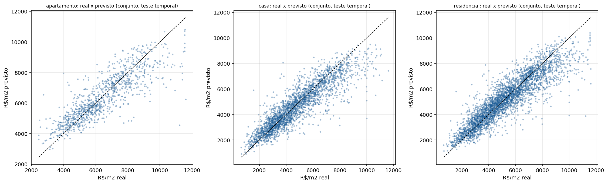
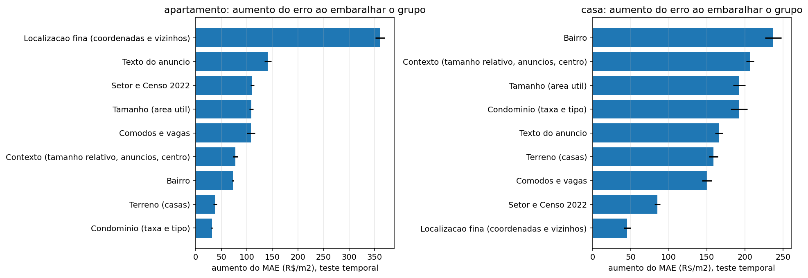
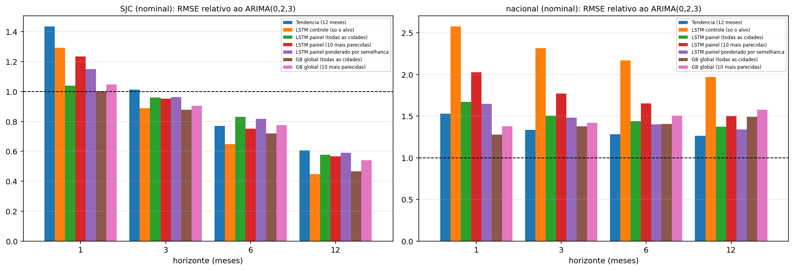
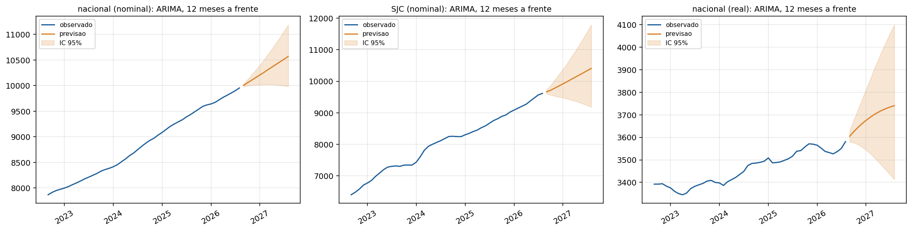
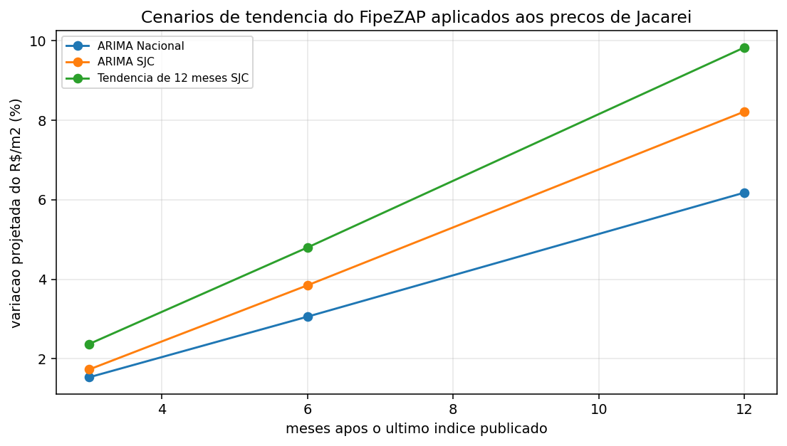
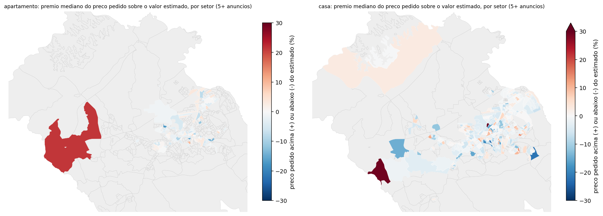

# Análise e previsão do mercado imobiliário de Jacareí-SP

Relatório analítico da iniciação científica · gerado automaticamente em 06/10/2026 06:38 por <code>python main.py relatorio</code> a partir dos resultados salvos. Números lidos dos arquivos; textos interpretativos conferidos contra os números (Apêndice C).

## 1. Resumo executivo

- **O que foi feito.** Duas trilhas sobre o mercado imobiliário de Jacareí-SP: (i) **precificação** do R$/m² de cada anúncio (VivaReal, março/2026) e
  (ii) **séries temporais** do índice FipeZAP (nacional e São José dos Campos) com ARIMA, LSTM e gradient boosting global, combinadas numa **projeção de preço**.
- **Precificação.** O conjunto final de modelos explica **R² = 0,73 (apartamento)** e **0,80 (casa)** do R$/m² no teste temporal
  (anúncios mais recentes), com MAPE de 11,1% e 15,0%. Medido como a literatura brasileira costuma medir (preço total,
  partição aleatória), o R² sobe para 0,85 e 0,90.
- **Séries.** No índice nacional o **ARIMA(0,2,3) é o melhor modelo** (erro de 1,18% em 12 meses). Em São José dos Campos as redes e o gradient boosting erram menos aos 6 e 12 meses,
  mas **sem significância estatística** (poucas origens de teste). Nenhum modelo é uniformemente melhor.
- **Projeção.** A mediana do valor estimado hoje é de **R$ 6.458/m² (apartamento)** e **R$ 4.597/m² (casa)**; o cenário central (ARIMA de SJC)
  aponta **8,2%** em 12 meses (alta se positivo), com IC95 de -4,5% a 22,6%.
- **Ressalva principal.** São preços **pedidos** em anúncios de um único dia, e o FipeZAP **não cobre Jacareí** (a tendência usa São José dos Campos como referência).

## 2. Objetivo, escopo e dados

**Objetivo.** Analisar e prever o mercado imobiliário de Jacareí-SP (iniciação científica). As metas do projeto são coleta, tratamento, análise exploratória,
regressão e ARIMA, LSTM, comparação ARIMA x LSTM, sensibilidade das variáveis, visualizações interativas e este relatório.

**Duas trilhas, porque os dados impõem isso:**

| Trilha | Dados | O que se prevê |
|---|---|---|
| Precificação | VivaReal de Jacareí: uma fotografia de março/2026 | O R$/m² de um anúncio, a partir das características do imóvel e da localização (previsão **transversal**, não no tempo) |
| Séries temporais | FipeZAP (índice nacional desde 2008, 224 meses; São José dos Campos desde 2018, 104 meses) e variáveis macro (BCB, IBGE, IPEA) | O índice de preço de venda nos próximos meses (ARIMA, ARIMAX, LSTM, gradient boosting) |

O VivaReal **não** permite previsão no tempo (é uma fotografia, com viés de sobrevivência nas datas de criação), e o FipeZAP **não tem Jacareí**: por isso a ponte entre as trilhas
é uma premissa explícita (Jacareí acompanha São José dos Campos).

**Dados do VivaReal.** A base tem **23.128** registros; **21.191** são residenciais e **19.207** permanecem após remover 1.984 duplicatas (mesmo anúncio coletado mais de uma vez; fica o registro mais recente). Os dados foram separados em **apartamento (3.992)**, **casa (10.254)** e **residencial
(14.246)**, com limites de preço, área e cômodos por segmento e remoção de valores extremos por IQR. Taxas implausíveis de condomínio e IPTU viram ausentes
(o IPTU ficou fora dos modelos: a unidade do campo não está confirmada).

**Informação externa.** Setores censitários do IBGE (Censo 2022; 544 setores em Jacareí) e variáveis do Censo por setor (renda do responsável, densidade, moradores por domicílio,
domicílios vagos), atribuídos às coordenadas por junção espacial.

**Dados faltantes e como foram tratados** (detalhe em `docs/DIARIO_MODELAGEM.md`):

| Problema | Tratamento |
|---|---|
| Coordenadas ausentes (~52% dos anúncios) | Imputação hierárquica só com coordenadas (mediana da rua no bairro, depois do bairro), nunca com o preço; cobertura de 99% |
| Taxa de condomínio ausente | Indicador de ausência e o valor (a ausência é informativa) |
| Suítes ausentes | Valor nativo ausente nas árvores; indicador no modelo linear |
| Bairros e setores raros | Agrupados em uma categoria (bairro < 30 anúncios, setor < 15) |
| Anúncios duplicados | Mantido o mais recente (evita o mesmo anúncio no treino e no teste) |
| Texto do anúncio | 150 palavras e bigramas, **sem dígitos nem preços** (o preço aparece em 19% dos títulos: seria vazamento do alvo) |

## 3. Métodos

### 3.1 Precificação (R$/m² de um anúncio)

- **Validação.** Divisão **temporal**: treino nos 75% de anúncios mais antigos (pela data de criação) e teste nos 25% mais recentes, a mais exigente; também holdout aleatório de 20% e 5-fold.
  Métricas: R², MAE (R$/m²) e MAPE (%).
- **Modelos.** Regressão linear (referência), HistGradientBoosting, LightGBM e CatBoost; **conjunto** (média dos três ajustados).
- **Variáveis.** Características do imóvel (área, cômodos, vagas, suítes, tipo, condomínio), bairro, coordenadas, preço dos 15 vizinhos reais mais próximos
  (calculado **sem vazamento**: cada anúncio fica fora do próprio cálculo), setor IBGE e Censo 2022, área do terreno, indicadores de palavras do anúncio e contexto (área relativa ao bairro, número de
  anúncios na rua e no bairro, distância ao centro).
- **Ajuste de parâmetros.** Busca bayesiana (Optuna/TPE) com validação cruzada interna **só no treino**; o teste nunca participa da escolha.
- **Incerteza.** Intervalos **conformais**: quantil do erro relativo fora da amostra no treino; testados no teste temporal.
- **Importância e sensibilidade.** Permutação por grupo de variáveis e cenários "e se?" sobre o modelo final.

### 3.2 Séries temporais (índice FipeZAP)

- **Transformação.** Log do índice; `d = 2` (testes ADF e KPSS); ARIMA(0,2,3) (a média móvel trimestral do índice aparece como MA(3)).
- **Avaliação.** *Walk-forward* com janela expansiva (1, 3, 6 e 12 meses), contra benchmarks (ingênuo e tendência), com teste de **Diebold-Mariano** (Newey-West, ajuste de Harvey).
- **Variáveis externas.** Painéis "as-of" (cada linha traz só o que já estava publicado, com defasagens confirmadas) e teste automático de vazamento temporal.
- **LSTM e painel.** Rede de 1 camada em **painel de 50 cidades**, modelando o crescimento padronizado; variantes com todas as cidades, as 10 mais parecidas e ponderação por semelhança;
  gradient boosting global como comparador.

### 3.3 Projeção de preço

Valor estimado de cada anúncio por previsões **fora da amostra** (5 partições), levado de março/2026 até o último índice com a variação **observada** de São José dos Campos, e depois
projetado com a **previsão** do ARIMA de SJC (cenário central), comparado ao ARIMA nacional e à tendência dos últimos 12 meses.

## 4. Resultados: precificação

### 4.1 Evolução do R² (teste temporal)

| Etapa | Apartamento | Casa | Residencial |
|---|---|---|---|
| Regressão linear (variáveis do imóvel e bairro) | 0,488 | 0,583 | 0,596 |
| Linear + preço dos vizinhos mais próximos | 0,573 | 0,608 | 0,626 |
| Gradient boosting, sem coordenadas | 0,620 | 0,721 | 0,726 |
| + coordenadas (imputadas pelo bairro) | 0,680 | 0,729 | 0,735 |
| + vizinhos, setor IBGE e Censo 2022 | 0,691 | 0,729 | 0,741 |
| + terreno e texto do anúncio | 0,693 | 0,773 | 0,767 |
| LightGBM ajustado (Optuna) | 0,725 | 0,803 | 0,809 |
| Conjunto final de 3 modelos | 0,730 | 0,800 | 0,807 |

Trocar o modelo linear por árvores (gradient boosting) foi o maior salto isolado de desempenho nos três segmentos. A informação nova (terreno, texto, condomínio) e o ajuste de parâmetros acrescentaram ganhos menores, porém consistentes. O Censo 2022 acrescentou pouco, por ser redundante com a localização.
O CatBoost ajustado não superou seus parâmetros padrão (apenas 8 tentativas).

*Figura: Preço real e previsto no teste temporal (conjunto final)*

### 4.2 Modelos finais

| Modelo | R² — apartamento | R² — casa | MAE (R$/m²) — apartamento | MAE (R$/m²) — casa |
|---|---|---|---|---|
| HistGradientBoosting, padrão | 0,711 | 0,781 | 709 | 676 |
| HistGradientBoosting, ajustado | 0,724 | 0,792 | 691 | 651 |
| LightGBM, padrão | 0,708 | 0,785 | 719 | 672 |
| LightGBM, ajustado | 0,725 | 0,803 | 687 | 631 |
| CatBoost, padrão | 0,709 | 0,779 | 723 | 676 |
| CatBoost, ajustado | 0,709 | 0,779 | 730 | 679 |
| Conjunto dos 3 ajustados | 0,730 | 0,800 | 684 | 638 |

No apartamento o conjunto supera o melhor modelo único; em casa e no residencial o LightGBM sozinho empata com o conjunto (diferença dentro do ruído).

### 4.3 Qualidade dos intervalos de previsão

| Segmento | Nível nominal | Cobertura no teste (%) | Erro relativo do intervalo (±%) | Largura média (R$/m²) |
|---|---|---|---|---|
| Apartamento | 80% | 82,3 | 18,0 | 2.290 |
| Apartamento | 90% | 91,1 | 24,2 | 3.084 |
| Casa | 80% | 81,9 | 23,6 | 2.196 |
| Casa | 90% | 90,6 | 32,3 | 3.003 |
| Residencial | 80% | 81,4 | 22,3 | 2.300 |
| Residencial | 90% | 90,8 | 30,8 | 3.184 |

A cobertura observada fica a até 3 pontos percentuais do nível nominal nos três segmentos: os intervalos são bem calibrados. O erro de avaliar um imóvel isolado, porém, é grande: mediana do erro relativo fora da amostra de
8,1% no apartamento e 10,4% na casa.

### 4.4 O que mais pesa e o que muda o preço

Relevância por grupo de variáveis (aumento do erro ao embaralhar o grupo, teste temporal):

- **Apartamento**: localização fina (+360 R$/m² de erro; +53%); texto do anúncio (+141 R$/m² de erro; +21%); setor e censo 2022 (+110 R$/m² de erro; +16%).
- **Casa**: bairro (+237 R$/m² de erro; +37%); contexto (+207 R$/m² de erro; +32%); tamanho (+192 R$/m² de erro; +30%).

Cenários “e se?” (mediana entre os imóveis, mantendo o resto):

| Segmento | Cenário | Variação do R$/m² (%) | Variação do preço total (R$) |
|---|---|---|---|
| Apartamento | +10% de área útil | -3,1 | 24.373 |
| Apartamento | +1 suíte | 4,6 | 19.998 |
| Apartamento | +1 vaga | 2,3 | 9.388 |
| Casa | +10% de área útil | -3,2 | 39.868 |
| Casa | +1 suíte | 0,9 | 6.709 |
| Casa | +1 vaga | 0,8 | 5.795 |
| Casa | +50 m² de terreno | 4,2 | 26.913 |
| Casa | casa passa a ser em condomínio | 7,1 | 43.530 |

*São associações aprendidas dos anúncios, não efeitos causais; o texto do anúncio tem 150 colunas, então seu peso de grupo deve ser lido como “traz informação”.*

*Figura: Relevância por grupo de variáveis*

## 5. Resultados: séries temporais

Mesmo *walk-forward* para todos os modelos (as redes são reajustadas a cada 12 meses; o ARIMA, todo mês). Comparações com Diebold-Mariano contra o ARIMA(0,2,3).

**Índice nacional (140 origens de teste)** — MAPE (%):

| Modelo | 1 mês | 3 meses | 6 meses | 12 meses |
|---|---|---|---|---|
| ARIMA(0,2,3) | 0,07 | 0,24 | 0,53 | 1,18 |
| Tendência (12 meses) | 0,11 | 0,32 | 0,67 | 1,47 |
| LSTM controle (só o alvo) | 0,18 | 0,56 | 1,16 | 2,27 |
| LSTM painel (todas as cidades) | 0,13 | 0,39 | 0,81 | 1,76 |
| LSTM painel (10 mais parecidas) | 0,15 | 0,44 | 0,91 | 1,87 |
| LSTM painel ponderado por semelhança | 0,13 | 0,38 | 0,78 | 1,71 |
| GB global (todas as cidades) | 0,10 | 0,36 | 0,75 | 1,69 |
| GB global (10 mais parecidas) | 0,10 | 0,35 | 0,80 | 1,76 |

**São José dos Campos (44 origens de teste)** — MAPE (%):

| Modelo | 1 mês | 3 meses | 6 meses | 12 meses |
|---|---|---|---|---|
| ARIMA(0,2,3) | 0,32 | 1,19 | 2,78 | 5,46 |
| Tendência (12 meses) | 0,46 | 1,26 | 2,19 | 3,45 |
| LSTM controle (só o alvo) | 0,41 | 1,13 | 1,89 | 2,13 |
| LSTM painel (todas as cidades) | 0,33 | 1,13 | 2,21 | 3,27 |
| LSTM painel (10 mais parecidas) | 0,39 | 1,15 | 2,04 | 2,47 |
| LSTM painel ponderado por semelhança | 0,36 | 1,16 | 2,26 | 3,25 |
| GB global (todas as cidades) | 0,34 | 1,13 | 1,95 | 2,50 |
| GB global (10 mais parecidas) | 0,35 | 1,19 | 2,08 | 2,86 |

- No índice nacional o ARIMA tem o menor erro em todos os horizontes (1, 3, 6 e 12 meses), contra todas as variantes de LSTM, o gradient boosting global e a tendência.
- Em São José dos Campos, aos 6 e 12 meses o melhor modelo alternativo erra menos que o ARIMA (12 meses: 2,13% contra 5,46%), mas nenhuma diferença é significativa a 5% aos 12 meses (menor p = 0,09), pois há poucas origens.
- O painel de 50 cidades ajuda o LSTM quando a série do alvo é longa (nacional), mas não quando é curta (SJC, onde o controle só com a própria série foi o melhor);
  a semelhança entre cidades não trouxe ganho consistente, e as cidades mais parecidas com SJC não são as vizinhas.
- **Resultados negativos que fazem parte do estudo:** ARIMAX com crédito, juros, confiança e IBC-Br, cidades vizinhas defasadas, combinações com tendência e aluguel/yield (razão preço/aluguel) **não** melhoraram o ARIMA
  de forma significativa no índice nacional; alguns o pioraram.
- O intervalo de 95% do ARIMA é conservador no nacional (cobertura de 99% a 100%) e cobre menos que o nominal em SJC: não é confiável para calibrar a incerteza.

*Figura: ARIMA, LSTM e gradient boosting: erro por horizonte*

*Figura: Previsão do ARIMA para o índice FipeZAP*

## 6. Projeção de preço de Jacareí

Medianas de R$/m² (valor estimado de cada anúncio por previsão fora da amostra; “hoje” = último índice publicado):

| Segmento | Anúncios | Pedido (mediana) | Estimado hoje | +3 meses | +6 meses | +12 meses |
|---|---|---|---|---|---|---|
| Apartamento | 3.992 | 6.175 | 6.458 | 6.570 | 6.706 | 6.989 |
| Casa | 10.254 | 4.375 | 4.597 | 4.676 | 4.774 | 4.974 |

Cenários de tendência (variação do R$/m² após o último índice publicado):

| Cenário | Horizonte (meses) | Variação (%) | IC95 inferior (%) | IC95 superior (%) |
|---|---|---|---|---|
| ARIMA SJC | 3 | 1,7 | -0,9 | 4,4 |
| ARIMA SJC | 6 | 3,8 | -1,8 | 9,8 |
| ARIMA SJC | 12 | 8,2 | -4,5 | 22,6 |
| Tendência de 12 meses SJC | 3 | 2,4 | — | — |
| Tendência de 12 meses SJC | 6 | 4,8 | — | — |
| Tendência de 12 meses SJC | 12 | 9,8 | — | — |
| ARIMA Nacional | 3 | 1,5 | 0,5 | 2,6 |
| ARIMA Nacional | 6 | 3,1 | 0,7 | 5,5 |
| ARIMA Nacional | 12 | 6,2 | 0,3 | 12,4 |

Os três cenários de tendência apontam alta em todos os horizontes. A incerteza do **valor de um imóvel específico** (±17% a ±23% em 80%) é muito maior que a da tendência; as duas não foram combinadas em um único intervalo.
**Premissas:** Jacareí acompanha a tendência de São José dos Campos e todos os imóveis variam igual (não há tendência por bairro).

*Figura: Cenários de tendência do FipeZAP aplicados a Jacareí*

*Figura: Preço pedido acima ou abaixo do valor estimado, por setor*

## 7. Comparação com a literatura

Comparar números entre estudos exige cuidado: mercados, períodos, **o que é previsto** (preço total ou R$/m²), **o tipo de preço** (anúncio ou venda) e **a forma de validar** (partição aleatória ou temporal)
mudam o resultado. A tabela resume os trabalhos usados; as ressalvas de cada um estão no apêndice B.

| Trabalho | Dados | Método | Resultado reportado |
|---|---|---|---|
| Neri (2020) | Apartamentos de Belo Horizonte-MG; 18.796 observações (16.919 treino e 1.877 teste). | Random Forest; separação aleatória 90% treino / 10% teste. | Erro médio absoluto percentual de 8,21% e R² de 93,92% no teste. |
| Pereira (2025) | Anúncios de imóveis de João Pessoa-PB obtidos por web scraping (número de observações não informado no resumo). | Gradient boosting (modelo principal). | R² de 85,42%, MAPE de 18,21% e RMSE de R$ 227.677 (nível de preço total); área foi a variável mais influente, seguida da razão quartos/área, vagas, coordenadas e aluguel médio do bairro. |
| Zilli & Bastos (2024) | 1.572 apartamentos da região central de Florianópolis-SC (de 8.694 registros), preços anunciados coletados por web scraping. | Random Forest, Gradient Boosting e regressão linear clássica. | Gradient boosting superou os demais em RMSE, MAE, MAPE, COD, PRD e R², com previsões até 30% mais precisas. |
| Bastos & Paquette (2024) | Preços de imóveis da Baía de São Francisco (EUA). | Regressão quantílica conformal (conformal quantile regression). | Os intervalos conformais têm cobertura exata; os de regressão quantílica não conformal cobrem muito menos que o nominal. Imóveis maiores, mais antigos, em bairros de renda baixa ou alta e há menos de um ano no mercado são mais difíceis de avaliar. |
| Hansson & Rostami (2019) | Preços mensais de casas na área de Estocolmo e em Uppsala, 2005 a início de 2019. | LSTM e SVM; o melhor foi comparado a um ARIMA sazonal, previsão de 12 meses. | O LSTM foi o melhor método de aprendizado de máquina, mas não previu tão bem quanto o ARIMA no horizonte de 12 meses. |
| Siami-Namini & Siami Namin (2018) | Séries econômicas e financeiras (não são preços de imóveis). | ARIMA contra LSTM, comparação por RMSE. | Relatam redução média do erro de 84% a 87% do LSTM em relação ao ARIMA. |

### 7.1 Precificação

Para comparar com trabalhos brasileiros, que reportam o **preço total** com **partição aleatória**, foi calculada a mesma medida a partir das previsões fora da amostra deste projeto:

| Medida | Apartamento | Casa |
|---|---|---|
| R² do preço total, partição aleatória (5-fold, fora da amostra) | 0,85 | 0,90 |
| MAPE do preço total (%) | 11,20 | 15,27 |
| R² do R$/m², teste temporal (conjunto final) | 0,73 | 0,80 |
| MAPE do R$/m², teste temporal (%) | 11,05 | 15,01 |
| Erro relativo mediano fora da amostra (%) | 8,14 | 10,38 |

- O MAPE do preço total (apartamento 11,2%, casa 15,3%) fica **entre** o de Belo Horizonte (8,21%) e o de João Pessoa (18,21%).
- O **R² do preço total é mais alto que o R² do R$/m²** porque a área explica boa parte do preço total. Os R² de 85% (João Pessoa) e 94% (Belo Horizonte) não são comparáveis ao R² do R$/m² deste projeto, que é menor
  por construção; o R² do preço total acima é a comparação justa (ambos com partição aleatória; o de Belo Horizonte usa uma única divisão 90/10, o deste projeto vem de 5 partições).
- Nos mesmos dados e divisões, o gradient boosting supera o Random Forest nos três segmentos (R² temporal 0,691 contra 0,657 no apartamento), o que **concorda** com a ordenação de Zilli e Bastos (2024).
- **Texto e informação adicional.** A literatura (Cambridge, UConn) indica que combinar atributos textuais e numéricos melhora os modelos. Aqui, terreno e texto elevaram o R² temporal das casas em 0,044, **de acordo** com a literatura.
  Em apartamentos o ganho do texto foi pequeno no teste temporal.
- **O que explica o preço.** Em João Pessoa, a área foi a variável mais influente, seguida de coordenadas e aluguel do bairro. Aqui a localização fina domina nos apartamentos e bairro, tamanho e condomínio nas casas: **mesma natureza**, com a área e a localização no topo.

### 7.2 Incerteza

Bastos e Paquette (2024) mostram que intervalos **conformais** têm cobertura correta, enquanto regressões quantílicas comuns cobrem menos que o nominal, e que imóveis maiores, mais antigos e de
bairros de renda extrema são mais difíceis de avaliar. Aqui os intervalos conformais cobrem próximo do nominal, e os das casas (mais heterogêneas) são mais largos que os dos apartamentos — **coerente** com o achado deles.

### 7.3 Séries temporais

- Hansson e Rostami (2019) encontram, em preços de casas de Estocolmo e Uppsala, que o ARIMA sazonal supera o LSTM em 12 meses. O resultado do índice nacional aqui é **o mesmo**.
- Siami-Namini e Siami Namin (2018) relatam redução de erro de 84% a 87% do LSTM sobre o ARIMA em séries econômicas e financeiras. Este projeto **não reproduz** esse resultado: o índice FipeZAP é uma série suave (média móvel de 3 meses), quase determinística,
  e o ARIMA é reestimado todo mês no *walk-forward*. São **hipóteses** para a diferença (natureza da série e forma de avaliar), não testadas aqui; o ponto é que o resultado depende do tipo de série e do desenho da avaliação.
- Em SJC, a série curta (104 meses) e o único período de teste limitam qualquer conclusão: as redes erram menos aos 6 e 12 meses, mas sem significância.

### 7.4 Preço pedido, preço de venda e outros avaliadores

- Os dados são **preços pedidos**. Segundo o FipeZAP (via B3 Bora Investir), o desconto médio de negociação é de cerca de 8% (12% quando há desconto), e 68% das compras de setembro/2025 tiveram desconto.
  As estimativas deste projeto são, portanto, **preços pedidos esperados**, e o preço de fechamento tende a ser menor. Nenhum ajuste de negociação foi aplicado.
- O erro mediano do avaliador automático da Zillow é de cerca de 7% para imóveis fora do mercado (cerca de 1,8% para os à venda, que usam o preço anunciado como entrada). O erro relativo mediano deste projeto
  (8,1% e 10,4%) é da **mesma ordem de grandeza**, em um mercado menor e com muito menos dados e variáveis, e prevendo o preço pedido.

> **Conclusão da comparação.** Os resultados são **consistentes** com a literatura nos pontos que podem ser comparados (gradient boosting e texto ajudam; intervalos conformais calibram; ARIMA vence o LSTM em
> índices imobiliários suaves), com a ressalva de que não há trabalho idêntico (Jacareí, preço pedido, validação temporal) e de que alguns números da literatura vêm só de resumos.

## 8. Limitações e ameaças à validade

| Limitação | Efeito | O que foi feito / o que falta |
|---|---|---|
| Preços **pedidos**, não de venda | O valor estimado é um preço pedido esperado; a venda tende a ser menor (desconto de negociação) | Documentado; sem ajuste. Falta uma base de preços de transação |
| Fotografia de **um dia** (março/2026) | Não há série temporal própria de Jacareí; a previsão no tempo depende de um proxy | Premissa explícita (SJC); coletar snapshots periódicos |
| FipeZAP **não tem Jacareí** | A projeção supõe que Jacareí acompanha SJC | Cenários alternativos (nacional, tendência); validar a aceitação do proxy |
| Poucos dados de SJC (104 meses; 44 origens de teste) | Resultados de SJC são indicativos, sem significância | Atualizar conforme novos meses forem publicados |
| Apartamentos com R² ~0,73 | Faltam qualidade, conservação, andar e idade do prédio | Buscar essas variáveis |
| Coordenadas reais em ~48% dos anúncios | O resto é imputado pelo bairro/rua | Imputação sem usar o preço; ganho limitado |
| Anúncios do mesmo prédio ou loteamento são parecidos | A divisão temporal reduz, mas não elimina, o vazamento entre treino e teste | Divisão temporal e vizinhos *leave-one-out* |
| Associações, não causalidade | Sensibilidade e cenários "e se?" descrevem o que o modelo aprendeu | Declarado nos textos |
| IPTU com unidade não confirmada | Ficou fora dos modelos | Confirmar a unidade do campo na fonte |
| Literatura comparada por resumos/páginas | Alguns números não foram verificados no texto completo | Ressalvas no apêndice B |

## 9. Conclusões e próximos passos

**Conclusões.**

1. É possível estimar o R$/m² anunciado em Jacareí com **R² de 0,73 (apartamento) e 0,80 (casa)** no teste mais exigente (anúncios mais recentes), com intervalos de previsão bem calibrados.
   O erro de um imóvel isolado continua alto (MAPE de 11,1% a 15,0%); o modelo serve melhor para estimar nível e comparar anúncios.
2. **Informação nova rendeu tanto quanto, ou mais que, o ajuste de parâmetros**: terreno e texto (casas) e a taxa de condomínio e o contexto do anúncio deram ganhos comparáveis ou maiores que a busca de hiperparâmetros; o Censo, redundante com a localização, rendeu pouco.
3. No índice FipeZAP o **ARIMA é difícil de bater**: vence no nacional; em SJC as redes parecem melhores em prazos longos, mas sem evidência estatística. Resultados negativos (aluguel, ARIMAX, vizinhas) estão documentados.
4. A projeção de preço de Jacareí é **coerente nos três cenários** (alta no horizonte de 12 meses), mas depende de duas premissas: Jacareí acompanha SJC e todos os imóveis variam igual.

**Próximos passos.**

1. Coletar **snapshots periódicos** do VivaReal para formar uma série própria de Jacareí e medir crescimento por área.
2. Variáveis de **qualidade do imóvel** (estado, andar, idade do prédio), que são o gargalo dos apartamentos.
3. Confirmar a **unidade do IPTU** na fonte e a adequação do FipeZAP de SJC como proxy de Jacareí.
4. Preços de transação (ou ajuste de negociação) para sair do preço pedido.
5. Atualizar os resultados de SJC quando houver mais meses e refazer a comparação ARIMA x LSTM.

## Apêndice A. Como reproduzir

Ordem dos comandos (tempos medidos nesta máquina, só CPU):

| Comando | Tempo | Produz |
|---|---|---|
| `python main.py vivareal-prep` | curto | datasets limpos por segmento |
| `python main.py series-coletar`, `series-fipezap`, `series-painel` | minutos | séries e painéis sem vazamento temporal |
| `python main.py reg-linear`, `reg-geo`, `ajuste-gb` | ~7 min (`ajuste-gb`) | regressão linear, geografia/Censo, ajuste |
| `python main.py arima`, `arima-plus` | ~45 s e ~2 min | ARIMA, ARIMAX, vizinhas |
| `python main.py lstm` | ~7 min | LSTM e gradient boosting em painel |
| `python main.py modelos-avancados` | ~70 min | modelos finais, conjunto e intervalos |
| `python main.py sensibilidade`, `projecao` | ~2,5 e ~4 min | sensibilidade e projeção |
| `python main.py prever --segmento ...` | ~40 s | avaliação de um imóvel |
| `python main.py painel`, `relatorio` | segundos | painel interativo e este relatório |

Os parâmetros e as sementes são fixos; reexecutar reproduz os números (uma execução interrompida do `modelos-avancados` reproduziu exatamente os mesmos números do apartamento na segunda tentativa).

## Apêndice B. Referências e ressalvas de comparabilidade

- **Neri (2020). Modelo preditivo do preço de venda de apartamentos em Belo Horizonte utilizando Random Forest. UFMG, especialização em Estatística.**  
  Dados: Apartamentos de Belo Horizonte-MG; 18.796 observações (16.919 treino e 1.877 teste). Método: Random Forest; separação aleatória 90% treino / 10% teste. Resultado: Erro médio absoluto percentual de 8,21% e R² de 93,92% no teste.  
  *Ressalva de comparabilidade:* Divisão aleatória (não temporal); o R² é do preço total (a área explica boa parte da variação), enquanto este projeto reporta o R² do R$/m².  
  <https://repositorio.ufmg.br//bitstreams/da9afed9-5cf3-4589-be88-519119e1adab/download>
- **Pereira (2025). Uso de aprendizado de máquina na modelagem preditiva dos valores de imóveis na cidade de João Pessoa. UFPB.**  
  Dados: Anúncios de imóveis de João Pessoa-PB obtidos por web scraping (número de observações não informado no resumo). Método: Gradient boosting (modelo principal). Resultado: R² de 85,42%, MAPE de 18,21% e RMSE de R$ 227.677 (nível de preço total); área foi a variável mais influente, seguida da razão quartos/área, vagas, coordenadas e aluguel médio do bairro.  
  *Ressalva de comparabilidade:* Não informa a divisão de validação no resumo; métrica sobre o preço total (RMSE em reais, não em R$/m²).  
  <https://repositorio.ufpb.br/jspui/handle/123456789/35103>
- **Zilli & Bastos (2024). Avaliação em massa de apartamentos com Random Forest e Gradient Boosting: estudo de caso de Florianópolis. Rev. Dep. Geografia (USP).**  
  Dados: 1.572 apartamentos da região central de Florianópolis-SC (de 8.694 registros), preços anunciados coletados por web scraping. Método: Random Forest, Gradient Boosting e regressão linear clássica. Resultado: Gradient boosting superou os demais em RMSE, MAE, MAPE, COD, PRD e R², com previsões até 30% mais precisas.  
  *Ressalva de comparabilidade:* O resumo não traz os valores absolutos das métricas por modelo; compara-se apenas a ordenação dos métodos.  
  <https://revistas.usp.br/rdg/article/view/212297>
- **Bastos & Paquette (2024). On the uncertainty of real estate price predictions. REM Working Paper 0314-2024 (ISEG, Univ. de Lisboa).**  
  Dados: Preços de imóveis da Baía de São Francisco (EUA). Método: Regressão quantílica conformal (conformal quantile regression). Resultado: Os intervalos conformais têm cobertura exata; os de regressão quantílica não conformal cobrem muito menos que o nominal. Imóveis maiores, mais antigos, em bairros de renda baixa ou alta e há menos de um ano no mercado são mais difíceis de avaliar.  
  *Ressalva de comparabilidade:* Outro país, dados de venda e método conformal com calibração em dados separados; este projeto usa o erro relativo fora da amostra.  
  <https://rem.rc.iseg.ulisboa.pt/wps/pdf/REM_WP_0314_2024.pdf>
- **Hansson & Rostami (2019). Time series forecasting of house prices: an evaluation of a support vector machine and a recurrent neural network with LSTM cells. Uppsala University (bachelor's thesis).**  
  Dados: Preços mensais de casas na área de Estocolmo e em Uppsala, 2005 a início de 2019. Método: LSTM e SVM; o melhor foi comparado a um ARIMA sazonal, previsão de 12 meses. Resultado: O LSTM foi o melhor método de aprendizado de máquina, mas não previu tão bem quanto o ARIMA no horizonte de 12 meses.  
  *Ressalva de comparabilidade:* Outro mercado e outra frequência/periodo; trabalho de graduação.  
  <https://www.maklarstatistik.se/wp-content/uploads/Time-Series-Forecasting-of-House-Prices-FredrikHansson_JakoRostami_kandidatuppsats2019.pdf>
- **Siami-Namini & Siami Namin (2018). Forecasting economics and financial time series: ARIMA vs. LSTM. arXiv:1803.06386.**  
  Dados: Séries econômicas e financeiras (não são preços de imóveis). Método: ARIMA contra LSTM, comparação por RMSE. Resultado: Relatam redução média do erro de 84% a 87% do LSTM em relação ao ARIMA.  
  *Ressalva de comparabilidade:* Séries financeiras/econômicas, muito mais ruidosas e longas que um índice imobiliário suavizado; o resumo não detalha a reestimação ao longo do tempo (walk-forward).  
  <https://arxiv.org/pdf/1803.06386>
- **Cambridge, Natural Language Engineering: "Describe the house and I will tell you the price"; e UConn: "Information value of property description: a machine learning approach" (2019).**  
  Dados: Anúncios e descrições textuais de imóveis. Método: Vetorização de texto (TF-IDF, Word2Vec, BERT) combinada a atributos numéricos. Resultado: O desempenho é melhor quando se combinam atributos textuais e numéricos; modelos de ML superam a regressão hedônica linear. O UConn estima que um desvio-padrão de qualidade não observada, medida pelo texto, corresponde a cerca de +15% no preço de venda.  
  *Ressalva de comparabilidade:* Lidos pelos resumos/páginas de busca; mercados e métodos diferentes. Este projeto usa só indicadores de palavras e remove preços e números do texto.  
  <https://www.cambridge.org/core/journals/natural-language-engineering/article/describe-the-house-and-i-will-tell-you-the-price-house-price-prediction-with-textual-description-data/807584C6B9D76F555DA61E220BF39F9B>
- **FipeZAP, via B3 Bora Investir: desconto médio entre o preço anunciado e o de fechamento.**  
  Dados: Compras de imóveis no Brasil; série histórica de 12 anos, dado mais recente de set/2025. Método: Levantamento de descontos em negociações. Resultado: Desconto médio de 8% em todas as transações (média de 12 anos) e de 12% nas negociações com desconto; 68% das compras de set/2025 tiveram desconto.  
  *Ressalva de comparabilidade:* Fonte secundária (reportagem); é o desconto de negociação no Brasil, não de Jacareí.  
  <https://borainvestir.b3.com.br/objetivos-financeiros/organizar-as-contas/qual-o-desconto-medio-que-se-consegue-na-hora-de-fechar-a-compra-de-imovel/>
- **Zillow: precisão do Zestimate (valor automatizado de imóveis nos EUA).**  
  Dados: Imóveis dos EUA, comparados ao preço final de venda. Método: Modelo automatizado de avaliação (AVM) da própria empresa. Resultado: Erro mediano de cerca de 1,8% nos imóveis à venda e de cerca de 7% nos que não estão à venda (varia ligeiramente com a atualização).  
  *Ressalva de comparabilidade:* O Zestimate de imóveis à venda usa o preço anunciado como entrada, o que este projeto não faz (o preço pedido é o alvo); o de imóveis fora do mercado é o mais comparável.  
  <https://www.zillow.com/zestimate>

*Os dados deste projeto: VivaReal de Jacareí (base de anúncios fornecida ao projeto, não versionada por conter dados pessoais de anunciantes), FipeZAP (planilha pública), BCB/IBGE/IPEA (APIs públicas) e Censo 2022 (IBGE).*

## Apêndice C. Verificação automática do texto

Todas as afirmações interpretativas foram checadas contra os números atuais e são sustentadas por eles.
